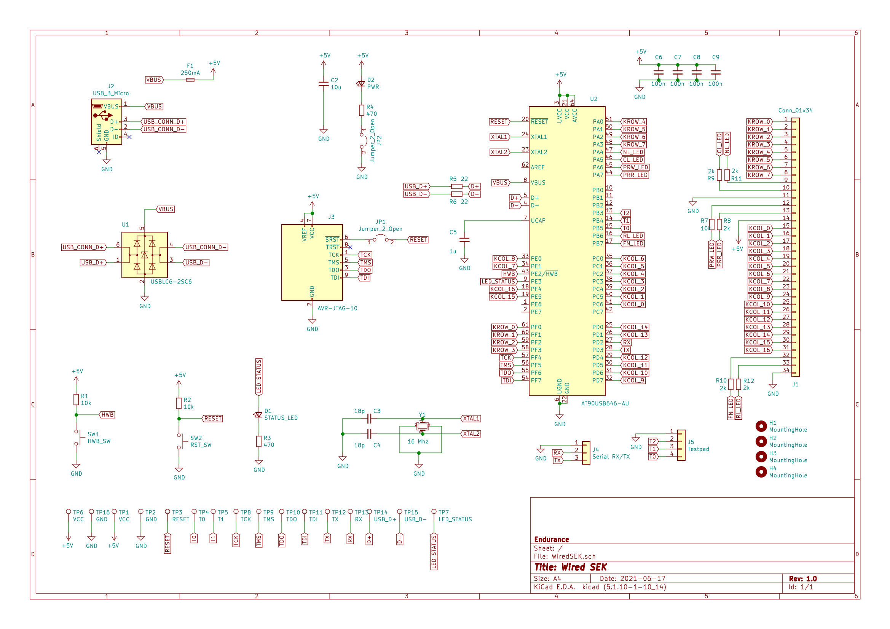
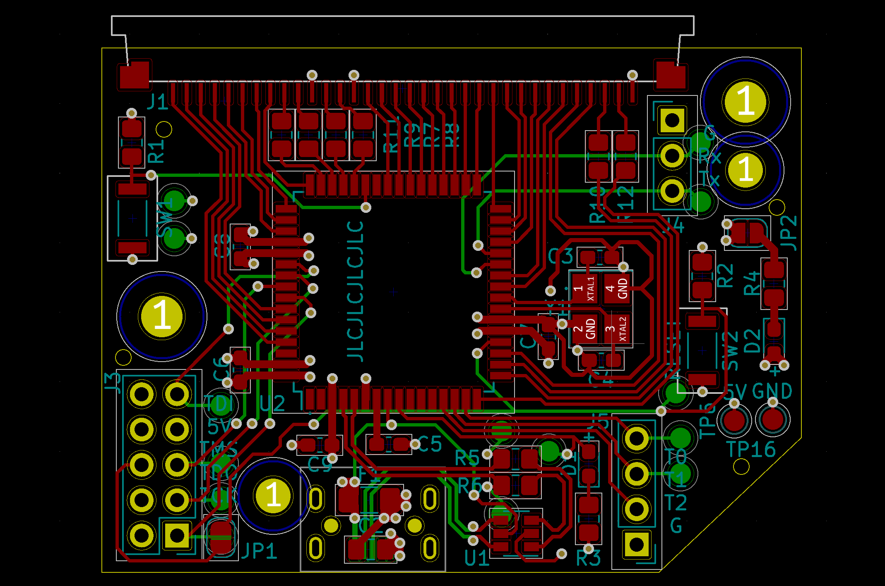
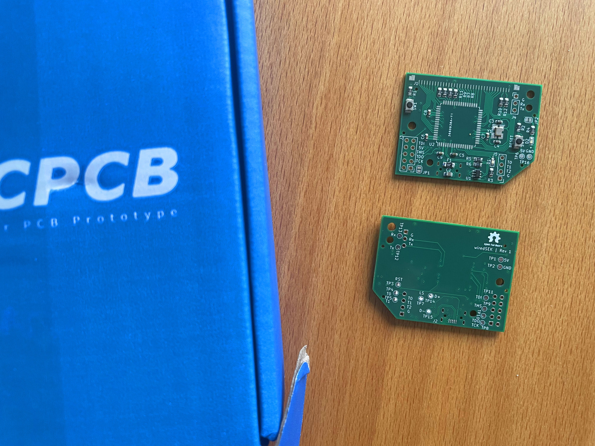
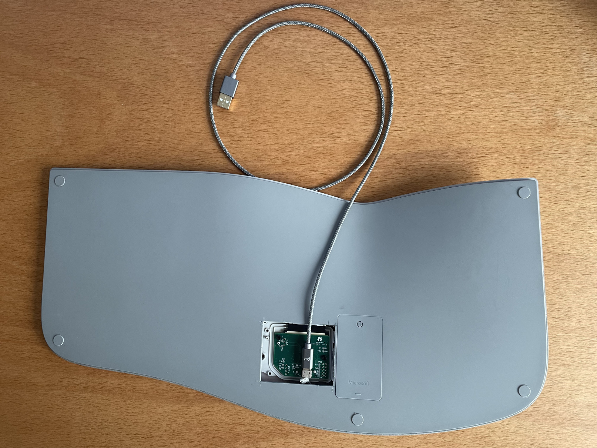

# A wired version of the Surface Ergonomic Keyboard from Microsoft.

## Disassembly
**Disclaimer**: These disassembly instructions can not be reversed and result in a broke keyboard. They are only provided as a documentation for other people to read, so that they dont have to brick their keyboard. So with that out of the way lets get started.

The keyboard is held together by an awful lot of glue and some screws. I do not own a heat gun and so i started with carefully using a screwdriver to remove the wrist rest. Even with a heat gun i doubt that it is impossible, to remove it without damaging some plastic. As can be seen in the following image, there is not only glue on the edges, but also in the center of the wrist rest.

The next step is to remove all 10 screws. 4 of them are small and 6 are rather large and threaded into the plastic. Then disconnect the power and paring button connector from the logic board. Next up is getting the screw driver back out and start to remove the keyboard panel from the case. It is held in place by a glue stripe all around the edges, some glue right in the center of the keyboard, and 9 glue spots as one can see in the following image.

4 more large screws hold the logic board cover in place. With them removed we can lift up the logic board and see the 34 pin Flexible Flat Cable (FFC) that connects the keyboard matrix with the logic board. 2 of those 34 lanes are not routed, so only 32 are actually connected.

I hoped that by fully disassembling the keyboard, I would be able to learn more about the keyboard matrix, but this did not turn out to be true. Anyway, after i removed every single plastic rivet and removed the remaining screws, this is how a fully disassembled surface ergonomic keyboard looks like:

Once the metal backplate is removed, the keys can just be popped out. They are still kept in place by small metal sheets and the wires connecting them. With the keyboard fully disassembled, we can now start to measure the keyboard matrix.

## Figuring out the keyboard matrix

With [@Geends](https://github.com/Geend/) logic analyzer and other hardware, we started by probing the logic level of every pin when no key is pressed. Next we toggled every LED (total of 4) one after another and observed the changes. Armed with that information we were able to make a educated guess of the keyboard matrix and with the 16 channel logic analyzer we were able to determine the full keyboard matrix.

Initial testing results:

| Pin Number (top left = 0)| Logic Level without Keypress |                            Function                           |
|:------------------------:|:----------------------------:| --------------------------------------------------------------|
| 0                        |3V                            | Keyboard Matrix: Row 0                                        |
| 1                        |3V                            | Keyboard Matrix: Row 1                                        |
| 2                        |3V                            | Keyboard Matrix: Row 2                                        |
| 3                        |3V                            | Keyboard Matrix: Row 3                                        |
| 4                        |3V                            | Keyboard Matrix: Row 4                                        |
| 5                        |3V                            | Keyboard Matrix: Row 5                                        |
| 6                        |3V                            | Keyboard Matrix: Row 6                                        |
| 7                        |3V                            | Keyboard Matrix: Row 7                                        |
| 8                        |3V                            | NumLink LED - with 3V the LED is off and on with 0.4V         |
| 9                        |3V                            | CapsLock LED - with 3V the LED is off and on with 0.4V        |
| 10                       |GND                           | Not connected                                                 |
| 11                       |1V                            | Pairing LED - White                                           |
| 12                       |1V                            | Pairing LED - Red                                             |
| 13                       |3V                            | LED Vcc                                                       |
| 14                       |0V                            | Keyboard Matrix: Column 0                                     |
| 15                       |0V                            | Keyboard Matrix: Column 1                                     |
| 16                       |0V                            | Keyboard Matrix: Column 2                                     |
| 17                       |0V                            | Keyboard Matrix: Column 3                                     |
| 18                       |0V                            | Keyboard Matrix: Column 4                                     |
| 19                       |0V                            | Keyboard Matrix: Column 5                                     |
| 20                       |0V                            | Keyboard Matrix: Column 6                                     |
| 21                       |0V                            | Keyboard Matrix: Column 7                                     |
| 22                       |0V                            | Keyboard Matrix: Column 8                                     |
| 23                       |0V                            | Keyboard Matrix: Column 9                                     |
| 24                       |0V                            | Keyboard Matrix: Column 10                                    |
| 25                       |0V                            | Keyboard Matrix: Column 11                                    |
| 26                       |0V                            | Keyboard Matrix: Column 12                                    |
| 27                       |0V                            | Keyboard Matrix: Column 13                                    |
| 28                       |0V                            | Keyboard Matrix: Column 14                                    |
| 29                       |0V                            | Keyboard Matrix: Column 15                                    |
| 30                       |0V                            | Keyboard Matrix: Column 16                                    |
| 31                       |3V                            | Fn LED - with 3V the LED is off and on with 0.4V              |
| 32                       |3V                            | Rollen - with 3V the LED is off and on with 0.4V              |
| 33                       |GND                           | Not connected                                                 |

The keyboard matrix from Surface Ergonomic Keyboard with german keys:

|           |    Row-0   |    Row-1   |    Row-2   |    Row-3   |    Row-4   |    Row-5   |    Row-6   |    Row-7   |
|:---------:|:----------:|:----------:|:----------:|:----------:|:----------:|:----------:|:----------:|:----------:|
| Column-0  |Num Entf    |Num 3       |Num 6       |Num 9       |Num \*      |6           |V           |L           |
| Column-1  |Num 0       |Num 2       |Num 5       |Num 8       |Num /       |5           |C           |K           |
| Column-2  |<           |Num 1       |Num 4       |Num 7       |Calc        |Num Enter   |X           |J           |
| Column-3  |Y           |T           |R           |E           |W           |Q           |Pfeil oben  |H           |
| Column-4  |-           |Bild Unten  |Bild Hoch   |Ende        |Num Lock    |Druck       |F12         |Leer        |
| Column-5  |.           |F4          |Entf        |Pos1        |Tab         |Einfg       |F11         |G           |
| Column-6  |,           |#           |0           |            |O           |Num +       |F10         |F           |
| Column-7  |M           |Ä           |9           |+           |i           |\`          |F9          |D           |
| Column-8  |N           |Num -       |8           |Ü           |U           |ß           |F8          |S           |
| Column-9  |Backspace   |Arrow right |7           |P           |Z           |^           |F7          |A           |
| Column-10 |Left Ctrl   |            |            |            |Right Ctrl  |            |            |            |
| Column-11 |            |Left Shift  |            |            |            |Right Shift |            |Fn          |
| Column-12 |            |            |Left ALT    |            |            |            |Alt Gr      |Context Menu|
| Column-13 |Pause       |Rollen      |Chat        |Left WIN    |Lock        |Rechteck    |            |Right WIN   |
| Column-14 |Num Clear   |4           |F1          |F5          |            |3           |Caps Lock   |Arrow Down  |
| Column-15 |            |F2          |F6          |Enter       |F3          |2           |            |Arrow Left  |
| Column-16 |Esc         |            |            |            |            |1           |B           |Ö           |

## Designing the PCB

The most difficult part was to find a MCU due to the chip shortage. From all the compatible controllers that are listed on QMKs website only the AT90USB646 was available. This turned out to be a perfect fit. It is a very simple MCU with enough GPIO pins, USB and a 64-TQFP package can be soldered by hand.

There is not much to say about the schematic itself because there is not a lot more on it then the MCU and a USB jack. There are a lot of testpoints, a power LED that can be disabled with a solder jumper, a status LED and a JTAG interface.

The complete board was designed with the open source software Kicad and tutorials from the Youtube channel Phil's Lab. This [[2]] three hour video is a great resource if someone wants to learn how to create a board from scratch and have it manufactured.

The outline and four holes (two placeholder and two for screws) are required for the circuit board to fit inside the keyboard. The position of the FFC/FPC connector is also fixed while the rest is up to us. 

The USB connector was the most difficult part to place. Because the keyboard is glued together and cannot be easily opened without damaging it, the plan is to make a small cutout where the PCB is located. So in a perfect world the connector would not need any more space than what is neccessary to switch the board. I managed this by using a right angle USB connector on the back of the PCB.

## PCB assembly

The USB connector, the FFC/FPC connector and the MCU had to be soldered by hand. Everything else was done by JLCPCB. These were the exact parts that i ordered. I included the USB cable not only because i like completeness, but also because not every cable will work. Between the USB connector and the PCB is only a limited amount of space for the plug.

* [FFC/FPC Connector](https://www.digikey.de/product-detail/de/F52R-1A7H1-11034/609-F52R-1A7H1-11034DKR-ND/11564783?itemSeq=366870776)
* [AT90USB646-AUR](https://www.digikey.de/product-detail/de/microchip-technology/AT90USB646-AUR/AT90USB646-AURCT-ND/3789393)
* [Micro USB Receptacle](https://www.digikey.de/product-detail/de/amphenol-icc-commercial-products/GMCB05801124EU/664-GMCB05801124EUTR-ND/13683048)
* [USB-Cabel](https://www.otto.de/p/primewire-premium-micro-usb-auf-usb-kabel-usb-a-stecker-auf-micro-b-stecker-600433312/#variationId=604008783)

## Keyboard assembly

## Software

## The finished Keyboard

The only remaining question should be: **Why?** I would be lying if i told you that this project was not fun for me but this is not the only reason. As a programmer you type **a lot**. It therefore makes perfect sense to spend some time and optimize the device that you use to insert every single character.

I stopped counting the keyboards that i used. From a 10$ standard Logitech keyboard up to a Moonlander from ZSA i tried pretty much everything. The Surface Ergnomic Keyboard from Microsoft and the Moonlander from ZSA were the ones i liked the most, sadly for different reasons.

The Alcantara wrist rest, the keytravel, the switches and the ergonomic layout are the things that i enjoyed most while using the keyboard from Microsoft. Obviously the biggest downside for me was that it only connected via Bluetooth. It was laggy, could only be connected to a single computer and if you did not type for a few seconds, the keyboard went directly to sleep and it takes about a second for it to wake up while forgetting the key you pressed. Very annoying.

## Related Work
Chad Austin made a wired version of the Sculpt Ergonomic Keyboard [[1]].
 
[1]: https://chadaustin.me/2021/02/wired-sculpt/
[2]: https://www.youtube.com/watch?v=C7-8nUU6e3E
