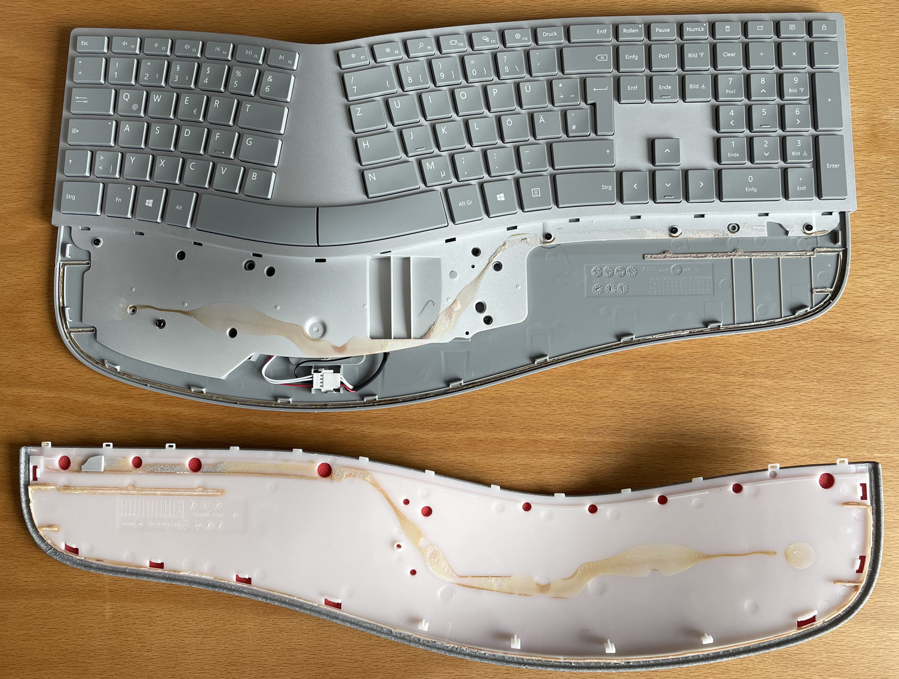
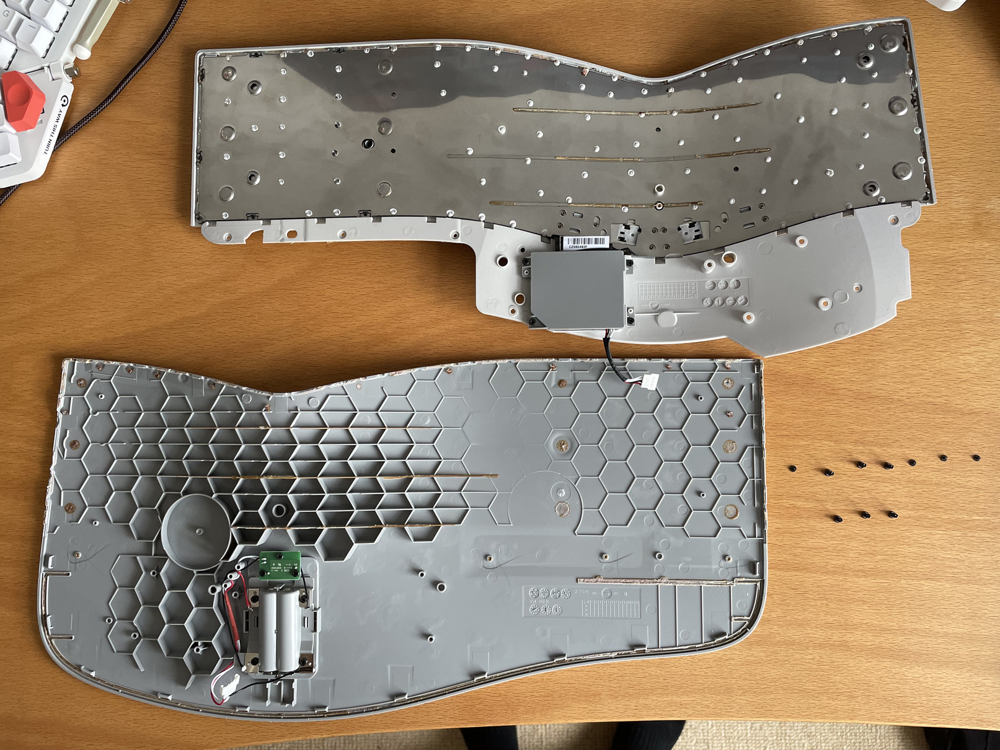
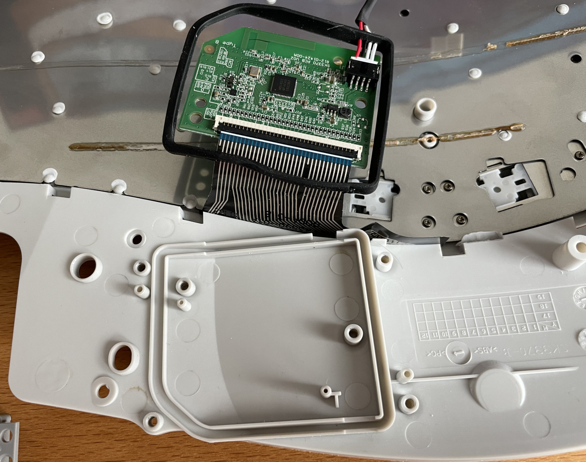
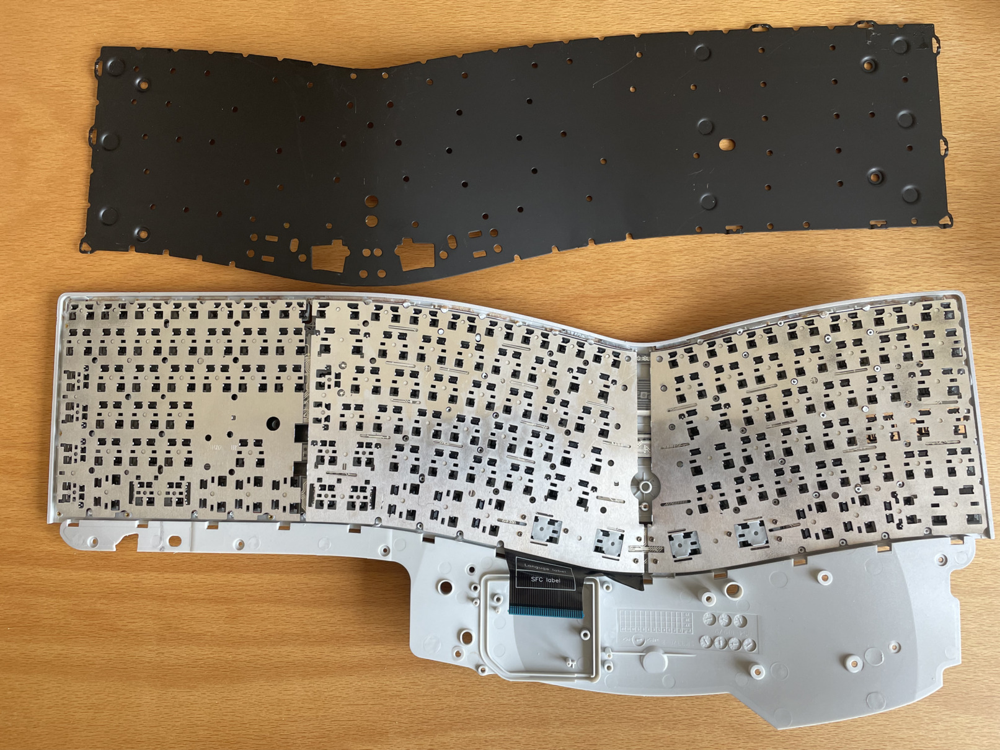
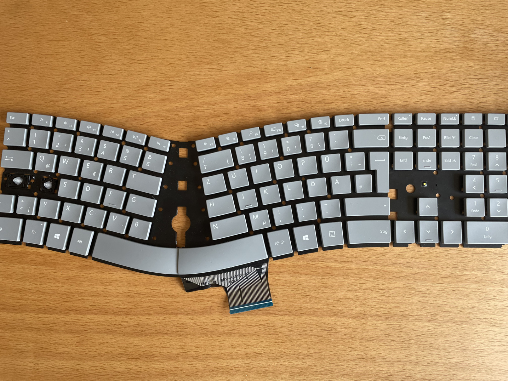
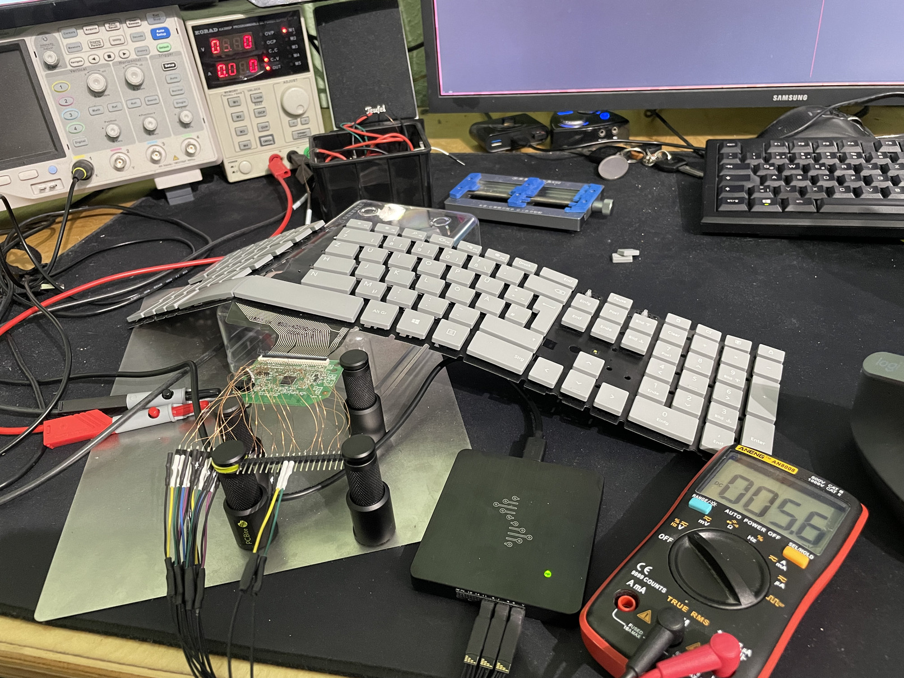

# A wired version of the Surface Ergonomic Keyboard from Microsoft.

## Disassembly
**Disclaimer**: These disassembly instructions can not be reversed and result in a broke keyboard. They are only provided as a documentation for other people to read, so that they dont have to brick their keyboard. So with that out of the way lets get started.

The keyboard is held together by an awful lot of glue and some screws. I do not own a heat gun and so i started with carefully using a screwdriver to remove the wrist rest. Even with a heat gun i doubt that it is impossible, to remove it without damaging some plastic. As can be seen in the following image, there is not only glue on the edges, but also in the center of the wrist rest.

The next step is to remove all 10 screws. 4 of them are small and 6 are rather large and threaded into the plastic. Then disconnect the power and paring button connector from the logic board. Next up is getting the screw driver back out and start to remove the keyboard panel from the case. It is held in place by a glue stripe all around the edges, some glue right in the center of the keyboard, and 9 glue spots as one can see in the following image.

4 more large screws hold the logic board cover in place. With them removed we can lift up the logic board and see the 34 pin Flexible Flat Cable (FFC) that connects the keyboard matrix with the logic board. 2 of those 34 lanes are not routed, so only 32 are actually connected.

I hoped that by fully disassembling the keyboard, I would be able to learn more about the keyboard matrix, but this did not turn out to be true. Anyway, after i removed every single plastic rivet and removed the remaining screws, this is how a fully disassembled surface ergonomic keyboard looks like:

Once the metal backplate is removed, the keys can just be popped out. They are still kept in place by small metal sheets and the wires connecting them. With the keyboard fully disassembled, we can now start to measure the keyboard matrix.

## Figuring out the keyboard matrix

With [@Geends](https://github.com/Geend/) logic analyzer and other hardware, we started by proping the logic level of every pin when no key is pressed. Next we toggled every LED (total of 4) one after another and observed the changes. Armed with that information we were able to make a educated guess of the keyboard matrix and with the 16 channel logic analyzer we were able to determine the full keyboard matrix.

Initial testing results:

| Pin Number (top left = 0)| Logic Level without Keypress |                            Function                           |
|:------------------------:|:----------------------------:| --------------------------------------------------------------|
| 0                        |3V                            | Keyboard Matrix: Colum 0                                      |
| 1                        |3V                            | Keyboard Matrix: Colum 1                                      |
| 2                        |3V                            | Keyboard Matrix: Colum 2                                      |
| 3                        |3V                            | Keyboard Matrix: Colum 3                                      |
| 4                        |3V                            | Keyboard Matrix: Colum 4                                      |
| 5                        |3V                            | Keyboard Matrix: Colum 5                                      |
| 6                        |3V                            | Keyboard Matrix: Colum 6                                      |
| 7                        |3V                            | Keyboard Matrix: Colum 7                                      |
| 8                        |3V                            | NumLink LED - with 3V the LED is off and on with 0.4V         |
| 9                        |3V                            | CapsLock LED - with 3V the LED is off and on with 0.4V        |
| 10                       |GND                           | Not connected                                                 |
| 11                       |1V                            | Pairing LED                                                   |
| 12                       |1V                            | Pairing LED                                                   |
| 13                       |3V                            | ???                                                           |
| 14                       |0V                            | Keyboard Matrix: Row 0                                        |
| 15                       |0V                            | Keyboard Matrix: Row 1                                        |
| 16                       |0V                            | Keyboard Matrix: Row 2                                        |
| 17                       |0V                            | Keyboard Matrix: Row 3                                        |
| 18                       |0V                            | Keyboard Matrix: Row 4                                        |
| 19                       |0V                            | Keyboard Matrix: Row 5                                        |
| 20                       |0V                            | Keyboard Matrix: Row 6                                        |
| 21                       |0V                            | Keyboard Matrix: Row 7                                        |
| 22                       |0V                            | Keyboard Matrix: Row 8                                        |
| 23                       |0V                            | Keyboard Matrix: Row 9                                        |
| 24                       |0V                            | Keyboard Matrix: Row 10                                       |
| 25                       |0V                            | Keyboard Matrix: Row 11                                       |
| 26                       |0V                            | Keyboard Matrix: Row 12                                       |
| 27                       |0V                            | Keyboard Matrix: Row 13                                       |
| 28                       |0V                            | Keyboard Matrix: Row 14                                       |
| 29                       |0V                            | Keyboard Matrix: Row 15                                       |
| 30                       |0V                            | Keyboard Matrix: Row 16                                       |
| 31                       |3V                            | Fn LED - with 3V the LED is off and on with 0.4V              |
| 32                       |3V                            | Rollen - with 3V the LED is off and on with 0.4V              |
| 33                       |GND                           | Not connected                                                 |

The keyboard matrix from Surface Ergonomic Keyboard with german keys:

|        |  Column-0  |  Column-1  |  Column-2  |  Column-3  |  Column-4  |  Column-5  |  Column-6  |  Column-7  |
|:------:|:----------:|:----------:|:----------:|:----------:|:----------:|:----------:|:----------:|:----------:|
| Row-0  |Num Entf    |Num 3       |Num 6       |Num 9       |Num \*      |6           |V           |L           |
| Row-1  |Num 0       |Num 2       |Num 5       |Num 8       |Num /       |5           |C           |K           |
| Row-2  |Y           |T           |R           |E           |W           |Q           |Pfeil oben  |H           |
| Row-3  |<           |Num 1       |Num 4       |Num 7       |Calc        |Num Enter   |X           |J           |
| Row-4  |-           |Bild Unten  |Bild Hoch   |Ende        |Num Lock    |Druck       |F12         |Leer        |
| Row-5  |.           |F4          |Entf        |Pos1        |Tab         |Einfg       |F11         |G           |
| Row-6  |,           |#           |0           |            |O           |Num +       |F10         |F           |
| Row-7  |M           |Ä           |9           |+           |i           |\`          |F9          |D           |
| Row-8  |N           |Num -       |8           |Ü           |U           |ß           |F8          |S           |
| Row-9  |Backspace   |Arrow right |7           |P           |Z           |^           |F7          |A           |
| Row-10 |Left Ctrl   |            |            |            |Right Ctrl  |            |            |            |
| Row-11 |            |Left Shift  |            |            |            |            |            |Fn          |
| Row-12 |            |            |Left ALT    |            |            |            |Alt Gr      |Context Menu|
| Row-13 |Pause       |Rollen      |Chat        |Left WIN    |Lock        |Rechteck    |            |Right WIN   |
| Row-14 |Num Clear   |4           |F1          |F5          |            |3           |Caps Lock   |Arrow Down  |
| Row-15 |            |F2          |F6          |Enter       |F3          |2           |            |Arrow Left  |
| Row-16 |Esc         |            |            |            |            |1           |B           |Ö           |

## Electronic components

[FFC/FPC Connector](https://www.digikey.de/product-detail/de/F52R-1A7H1-11034/609-F52R-1A7H1-11034DKR-ND/11564783?itemSeq=366870776)

[AT90USB646-AUR](https://www.digikey.de/product-detail/de/microchip-technology/AT90USB646-AUR/AT90USB646-AURCT-ND/3789393)

## Related Work
Chad Austin made a wired version of the Sculpt Ergonomic Keyboard [[1]].
 
[1]: https://chadaustin.me/2021/02/wired-sculpt/
